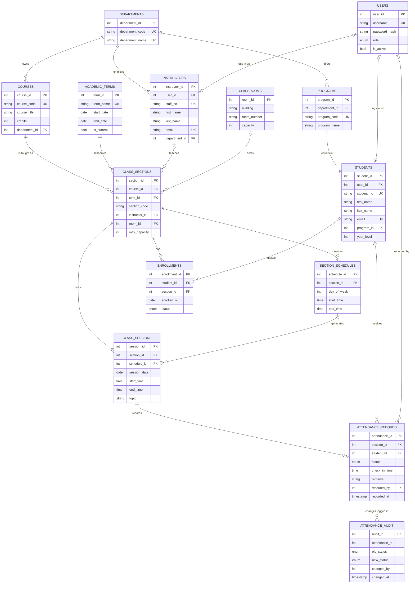

# Entity–Relationship Diagram

GitHub renders the diagram below automatically.



## Key business rules and constraints

| Rule | How it is enforced |
|---|---|
| A student can't be enrolled in the same section twice | `UNIQUE (student_id, section_id)` on `enrollments` |
| A student has only one attendance record per session | `UNIQUE (session_id, student_id)` on `attendance_records` |
| Attendance status is Present, Absent, Late or Excused | `CHECK` constraint (SQLite) / `ENUM` type (PostgreSQL) |
| Only enrolled students can receive attendance | trigger `trg_attendance_requires_enrollment` |
| Sections can't go over capacity | trigger `trg_enrollment_capacity` |
| Every status change is logged | trigger `trg_attendance_audit` → `attendance_audit` |
| A section is unique per course, term and section code | `UNIQUE (course_id, term_id, section_code)` |
| No duplicate sessions | `UNIQUE (section_id, session_date, start_time)` |
| Referential integrity | foreign keys with `RESTRICT`, `CASCADE` or `SET NULL` chosen for each relationship |

## Normalization (3NF)

- **1NF:** every column holds one atomic value. A section's weekly meetings are rows in `section_schedules` rather than a list in one column.
- **2NF:** every table has a single-column surrogate primary key, so no attribute depends on only part of a key. Natural keys (`student_no`, `course_code`, `username`) are kept as `UNIQUE` candidate keys.
- **3NF:** no non-key attribute depends on another non-key attribute:
  - Department names live only in `departments`, not in `courses` or `instructors`.
  - Program details live in `programs`, and a student stores only `program_id`.
  - Course title and credits live in `courses`, not in `class_sections`.
  - Room capacity lives in `classrooms`.
  - Login data (`users`) is kept separate from personal data (`students`, `instructors`).
  - Derived values such as attendance percentage are **not stored**. They are calculated in views (`v_student_section_attendance`, etc.), so they can never become inconsistent.

## Attendance percentage

```
attendance % = (Present + Late) / (sessions recorded − Excused) × 100
```

Excused absences are left out of the denominator, so they don't count against the student.
